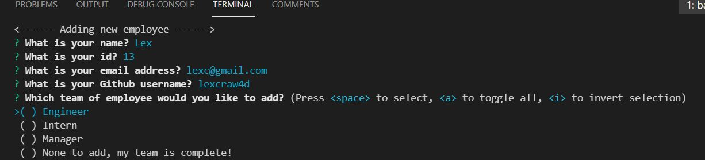
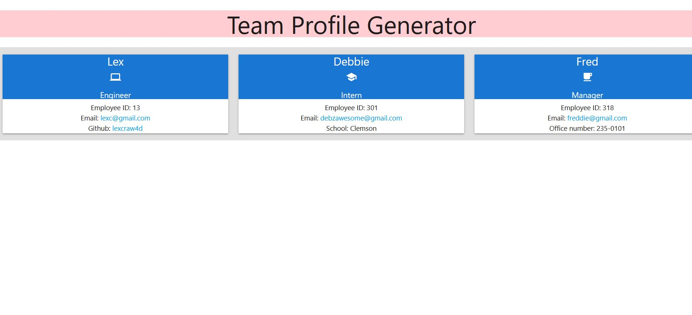
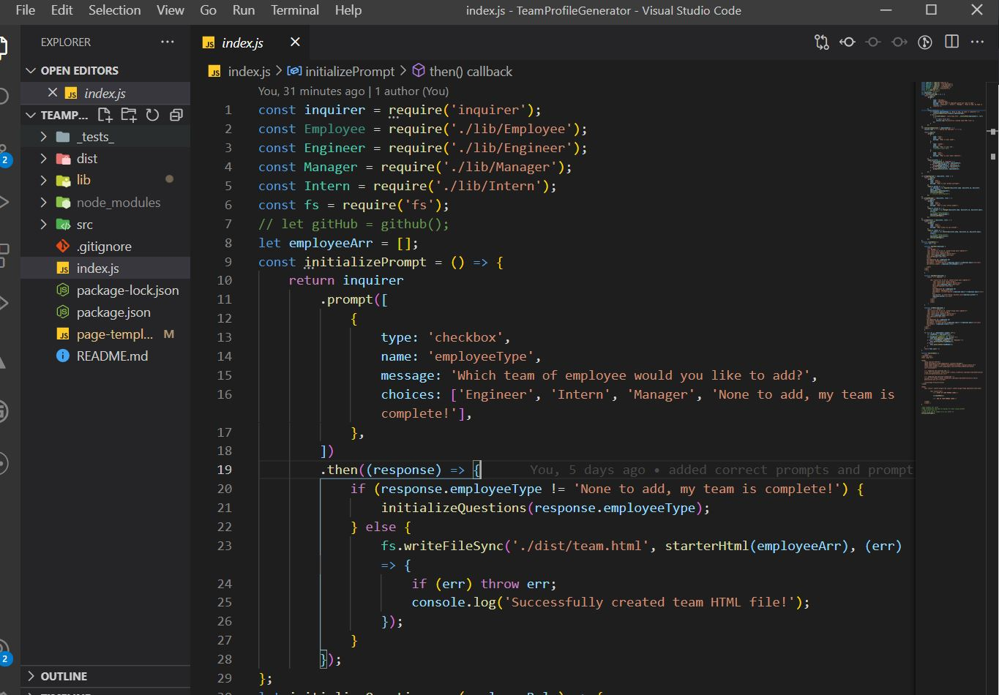
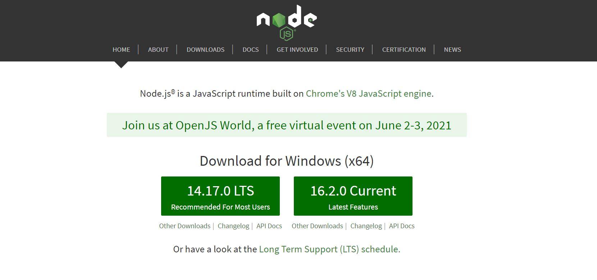
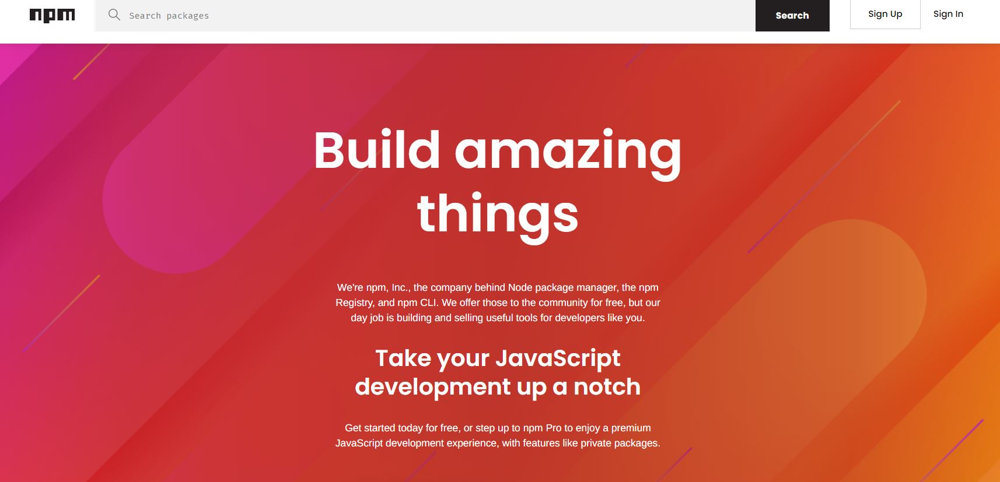
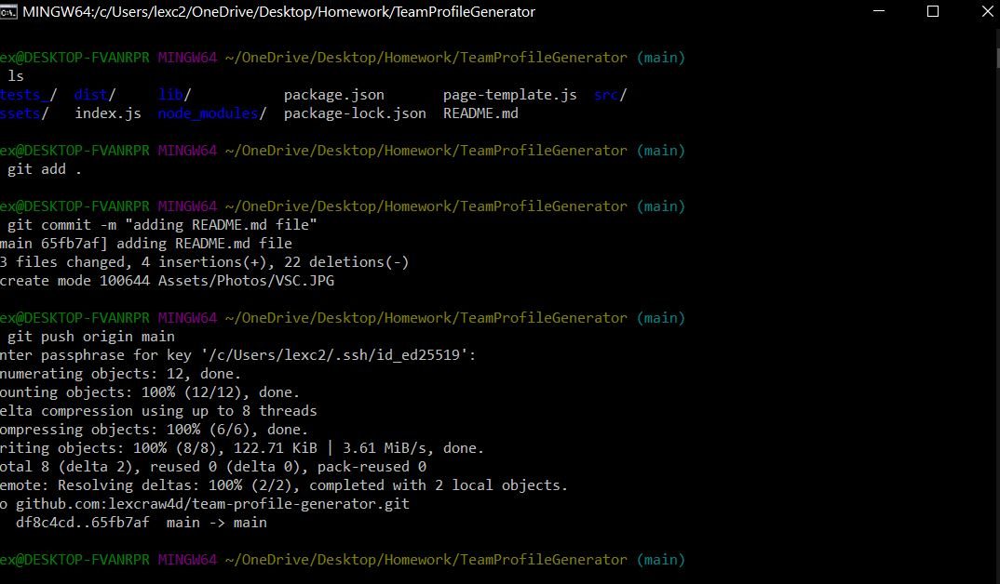

# Team Profile Generator

#### Table of Contents

- [About](#About)
- [Installation](#Installation)
- [Usage](#Usage)
- [Contribution](#Contribution)
- [License](#License)

# About
The Team Profile Generator was created for the user to quickly be able to create a  neat and clean html file, which includes information about the user's work team based on their responses using the command line interface(CLI). The Team Profile Generator was created using the command line application in [Visual Studio Code](https://code.visualstudio.com/) via [Node.js](https://nodejs.org/en/) given a set of prompts through [Inquirer's](https://www.npmjs.com/package/inquirer) [Node Package Manager (npm)](https://www.npmjs.com/). The user is prompted with detailed role-specific-questions that provide information that later will be used to create a final html file compiled of all employee roles that were entered along with their information.
Please visit [this video](https://drive.google.com/file/d/1YBGQGzkXizTpFmDODRhGQycl0UWuVa2X/view?usp=sharing) for a live demo, since all of the generator is made via the command line.

# Installation
To install please visit [my repository](https://github.com/lexcraw4d/team-profile-generator) and look at the uploaded files via GitHub Deployment. You may also fork my repository and download both [Node.js](https://nodejs.org/en/) and [Inquirer](https://www.npmjs.com/package/inquirer). Additionally, you will need [Visual Studio Code](https://code.visualstudio.com/).The details of how to implement these are provided in the [Usage](#Usage) section below.
# Usage
##### Visual Studio Code

Visual Studio Code (VS) was used to create, edit, and code the Team Profile Generator.

[Visual Studio Code](https://code.visualstudio.com/) is an lightning fast FREE open-source editor designed by [Microsoft](https://www.microsoft.com/en-us/) with developers in mind. Visual Studio code allows developers to easily apply the edit-build-debug cycle, resulting in more productivity on your ideas.

[Visual Studio Code](https://code.visualstudio.com/) brings all that you need as a developer, such as: debugging, instant editing results, customization specifically designed for your preference, hundreds of languages, extensions, version control, and more all at your fingertips!

### Node.js
Node.js was used in combination with VSC. You can dowload Node.js [here](https://nodejs.org/en/).

### npm and Inquirer

[npm](https://www.npmjs.com/package/inquirer) was used in combination with [Inquirer ](https://www.npmjs.com/package/inquirer) to prompt the user via CLI. Please click the referenced information for documentation on npm and Inquirer.

#### GitHub/Git

In order to make effective changes to the website both [Git](https://gitforwindows.org/) and [GitHub](https://github.com/) were used in synchronization to push commits of the latest updated version.

Git is version control system which allows multiple users to make changes to one single repository.

GitHub is a corporation which provides hosting for version control using Git and software development. [GitHub Docs ](https://docs.github.com/en/free-pro-team@latest/github/setting-up-and-managing-your-github-user-account/managing-user-account-settings) provides all needs for setting up your GitHub and answering problem-solving issues you may come across while using GitHub.

# Contribution

Feel free to contribute to this project in any of the following ways:

- [Submit bug and feature requests](https://github.com/lexcraw4d/team-profile-generator/issues)
- [Review Source Code Changes](https://github.com/lexcraw4d/team-profile-generator/pulls) and make pull requests from typos to content
- For specific concerns that do not meet the above please do not hesitate to reach out to me via [My GitHub](https://github.com/lexcraw4d).

If you are interested in fixing issues directly to the code base, please reference the [How to Contribute](https://github.com/microsoft/vscode/wiki/How-to-Contribute) article.

# License
This source code is available to everyone under the standard [MIT License](https://github.com/microsoft/vscode/blob/master/LICENSE.txt).

:copyright: 2021 Lexie Crawford :computer: :heart:
